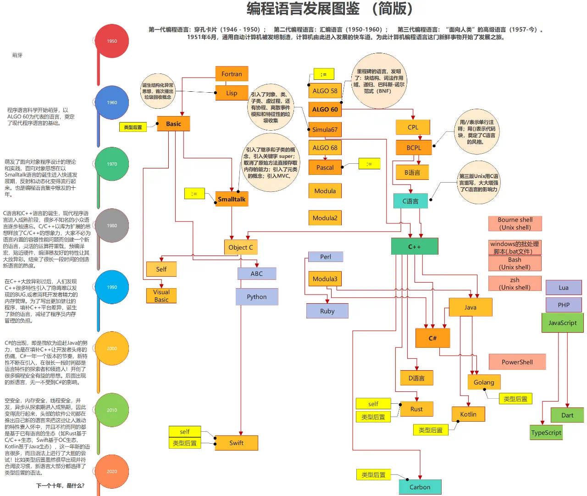

# 编程语言简介: 我要换门编程语言？

## 一、序言

最近，我又想要换门编程语言？这篇文章大概能治好墙头草两边倒的毛病。

### 1、编程语言讨论

据坊间统计，每位软件工程师的从业生涯中，想换门编程语言的念头高达6次，尤其是在定期年度话题讨论过后。

话题a: tiobe排行榜。截止2024年8月，流行编程语言排名是这样的，前五名分别是python/c++/c/java/c#。其中go第9名，php位列13名，swift第16名，kotlin位列18名。看完这个你第一反应是什么，我猜肯定是想要学python。

话题b: php不行了。自从2014年后，php排名就一直下滑，2010年首登前3的风光不再。在得知这个消息，我犹豫想放弃php。

话题c: ios就业危机。2015年出现有小公司半个月收到上千份ios简历，安卓与ios收到的简历比大约是1:7。庆幸自己当时没转ios开发。

话题d: 八股文竞赛。2018年在github出现了一个叫javaGuide的项目，截止2024年项目关注度高达14万人。意味着最少有14万小伙伴曾参与java八股文面试比赛。

话题e: 鹅厂1号前端被裁。2023年3月，传出爆炸性新闻，企鹅厂1号前端员工被裁员，为企鹅首个web前端专家。专家又能如何，铁打的营盘流水的兵。

话题f: fortran再度流行。2024年4月，67岁的编程语言fortran再度重返编程语言排行前十。好像熬着又突然可行了。

### 2、编程语言种类

编程语言到底有多少种？据不完全统计超过700种，每个开发者常听过的不少于20种。假设一名开发者想熟练掌握所有编程语言，我猜结果肯定要走火入魔的。

那么在开发者职业生涯中，到底该学多少门编程语言？哪种编程语言容易上手？还是固守在一门编程语言种而排除其他语言呢？或者有没有一种通用的学习编程语言的方法，这样需要使用一门新的编程语言，可以快速上手呢。

### 3、学习编程语言

到底谁在学习编程语言呢？我们讲人群分为两类：一是毫无编程经验的初学者，比如：大学毕业拿到go岗位，而要学习go语言；二是有编程经验的老鸟，比如：公司技术栈php转java，需要学习java语言。

初学者一般会经历这几个阶段，快速学习-能干活-疑难杂症。快速学习阶段指在完成大学计算机通识教育后，为工作而学习一门编程语言，你会看一本叫某某技术指南的书。能干活阶段则代表你已经入职，这时候重点则是快速熟悉项目，渐进式提高难度完成需求交付，最后成为负责项目熟练工。疑难杂症阶段则代表你可以独当一面，解决别人解决不了的问题，办法可是直面问题或者绕过问题，这时候我们一般称为你核心骨干。

老鸟则一般会经历这几个阶段，能干活-疑难杂症-技术选型。我们先介绍下什么是老鸟，职场经验丰富，对从业行业/工作环境/公司文化/业务流程有深入了解，能熟练地处理各种职场问题。跟初学者虽然都有快速学习/能干活阶段，但是你有自己的方法和速成办法。这里重点介绍一下技术选型阶段，不管是主导还是参与证明你都有一定的话事权，这时候你要知道业务技术痛点/发展趋势等等因素，而决策选难种语言，但是我相信大部分人都是拍脑袋的，为选择而选择。

## 二、编程语言发展简史

以史为鉴可以知兴替，同理以编程语言史可知后续。纵观编程语言发展史，可以简单概述为两句话：计算机硬件成本不断下降，从取悦机器到取悦人的演进。

### 1、编程语言世代

3GL时代。作为移动网络发展亲身经历，从2G到5G时代，感受到翻天覆地的变化。类似移动网络，对于编程语言也有世代之分，大致可以分成五个世代。而我们正处于第三代编程语言时代，the third generation of programming language，简称: 3GL。

第一代语言为机器语言，由0和1组成，可由处理器直接执行；第二代语言为汇编语言，需要汇编器转译才可以由处理器执行，第三代语言为高级语言，如：c语言/java/objective-c，第四代为极高级语言，如：sql语言，第五代语言为自然语言，如：chatgpt的prompt。

看到这里，应该治好了编程语言鄙视链毛病。曾经年少的我，也因为没写过诗一样的汇编语言而陷入深深内疚，直到现在我才明白，原来汇编语言时代就是诺基亚塞班时代。于是连忙把书架上最底下的java核心技术，拍了拍灰摆到最上层。

### 2、源于1972年

smalltalk和c语言。纵观编程语言发展，可以看到主流通用编程语言主要受2个成熟的语言影响，包括samlltalk和c语言，且都诞生于1972年。面向对象思想理论和实践在smalltalk语言的诞生后进入了快速发展期；c语言让大家不必为语言内置的容器性能问题而陷入新语言发明，标志着现代语言进入成熟阶段。

站在巨人肩膀。因为拥有smalltalk和c语言，编程语言的发展似乎进入了快车道。smalltalk+面向对象诞生了self，c语言+面向对象诞生了c++，而smalltalk+c语言+面向对象诞生了objective-c。c++和objective-c对c语言的100%兼容，意味着可以完全利用c语言的生态和人才。

因此，编程语言的很多指导思想是源于1972年的。

### 3、记住1995年

java的诞生。在c++大放异彩之后，开始发现c++很多特性导致晦涩的bug，内管管理消耗开发者大量精力。对c++做减法的java横空出世，成为了历史上最成功的语言之一。

记住1995年。这一年诞生了四个我们耳熟能详的编程语言：java、javascript、php、ruby。

## 三、什么是编程语言

什么是编程语言，维基百科是这样解释的：编程语言（英语：programming language），是用来定义计算机程序的形式语言。它是一种被标准化的交流技巧，用来向计算机发出指令，一种能够让程序员准确地定义计算机所需要使用数据的计算机语言，并精确地定义在不同情况下所应当采取的行动。

通俗解释编程语言是让我们能够控制计算机，指哪里打哪里，通过一些标准化的方式。为什么有那么多编程语言产生呢？起初计算机价格远远高于人力，编程语言更偏向机器，因此早期的编程语言称为机器(低级)语言。现在计算机便宜而人力贵，编程语言更偏向人，因此现在的编程语言称为高级语言。

## 四、编程语言分类

### 1、按编程范式分类

### 2、按应用领域分类

### 3、按运行时环境分类

## 五、未来展望

## 参考资料
- [TIOBE指数](https://www.tiobe.com/tiobe-index/)
- [七十年编程语言发展漫谈](https://mp.weixin.qq.com/s/j1uIcYeq1nDjZSMCDti2Cg)
- [The Development of the C Language](https://www.bell-labs.com/usr/dmr/www/chist.html)